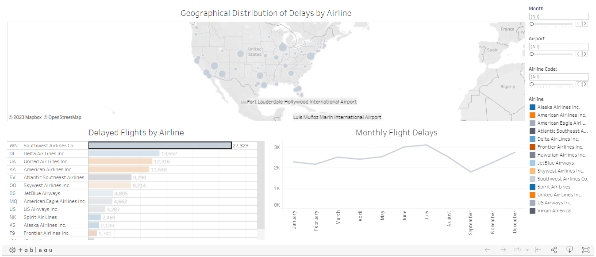

# Air Travel Analysis Insights using Tableau

This repository contains insights derived from an analysis of air travel data using Tableau. The visualizations and findings aim to provide a comprehensive understanding of delayed flights, focusing on the airlines, months, and airports that are most affected.

## Insight #1: Airline with the Highest Number of Delayed Flights

**Total Delayed Flights by Airline:**

- [Explore Total Flight Delays](https://public.tableau.com/views/TotalDelayedFlightsByAirline/TotalDelayedFlights?:language=en-US&publish=yes&:display_count=n&:origin=viz_share_link)

- Airline Code: WN
- Airline: Southwest Co.
- Delayed Flights: 27,323

Southwest Co. (Airline Code: WN) holds the record for the highest number of delayed flights, with a total of 27,323 delays.

## Insight #2: Monthly Variations in Delayed Flights

**Monthly Flight Delays Overview:**

- [Explore Monthly Flight Delays](https://public.tableau.com/views/MonthlyFlightDelaysOverview/MonthlyFlightDelaysOverview?:language=en-US&:display_count=n&:origin=viz_share_link)

- Month: July
- Airline: Southwest Co.
- Delayed Flights: 27,323

July stands out as a month with significant delays, particularly for Southwest Co., recording 27,323 delayed flights. The Tableau visualization provides a detailed overview of monthly flight delays.

## Insight #3: Highest Peak in Departure Delays by Month

**Monthly Departure Delay Overview:**

- [Explore Monthly Departure Delays](https://public.tableau.com/views/MonthlyDepartureDelayOverview/MonthlyDepartureDelayOverview?:language=en-US&publish=yes&:display_count=n&:origin=viz_share_link)

- Month: July
- Departure Delay: 93,003
- Airline Code: WN
- Airline: Southwestern Airlines

July experienced the highest peak in departure delays, reaching a total of 93,003 minutes. Southwest Co. (Airline Code: WN) operated by Southwestern Airlines contributed significantly to this surge.

## Insight #4: Airport with the Highest Number of Delayed Flights

**Geographical Distribution of Delays by Airline:**

- [Explore Flight Delay Overview](https://public.tableau.com/views/FlightDelayOverview/FlightDelayOverview?:language=en-US&:display_count=n&:origin=viz_share_link)

- Airport Code: ATL
- Airport: Hartsfield-Jackson International Airport
- Delayed Flights: 6,790

Hartsfield-Jackson International Airport (Airport Code: ATL) takes the lead with 6,790 delayed flights. The geographical distribution visualization in Tableau offers insights into delays at various airports.

These insights aim to enhance our understanding of delayed flights, and the Tableau visualizations provide interactive tools for further exploration and analysis. Feel free to explore the visualizations linked above for a more detailed view of the data.
